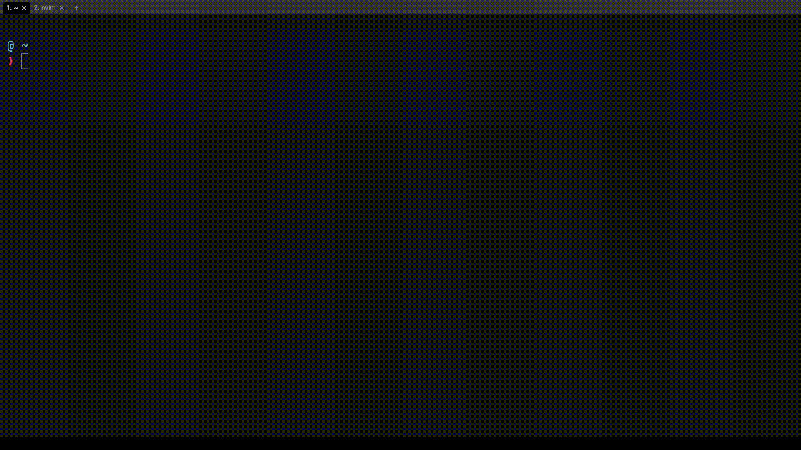

# goBackBash

Linux command that allows you to choose to change directory (cd) to a directory from your last history.

If you decide to download this please read the code first, i do not have a deep understanding of linux nor bash

## Installation guide
1. Clone the repository

`gh repo clone all0ver/goBackBash`

2. Run the install.sh file

`./install.sh`

3. Use `cb` (comeback) command
